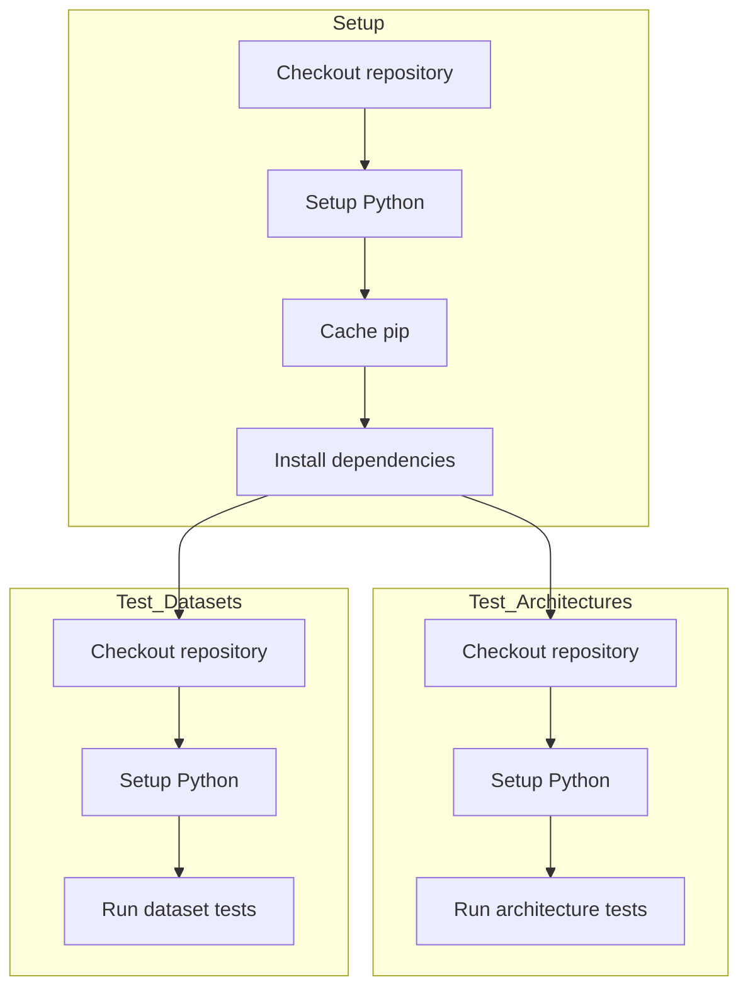

# CI Workflow Overview

This diagram illustrates the continuous integration (CI) workflow for running tests in this project. The workflow consists of three main jobs:
- Setup: Prepares the environment by checking out the repository, setting up Python, caching pip dependencies, and installing required packages.
- Test Architectures: Runs tests related to architectural components of the codebase.
- Test Datasets: Runs tests related to dataset handling and processing.

The architecture and dataset tests both depend on the successful completion of the setup job, ensuring dependencies are installed and cached before running.

