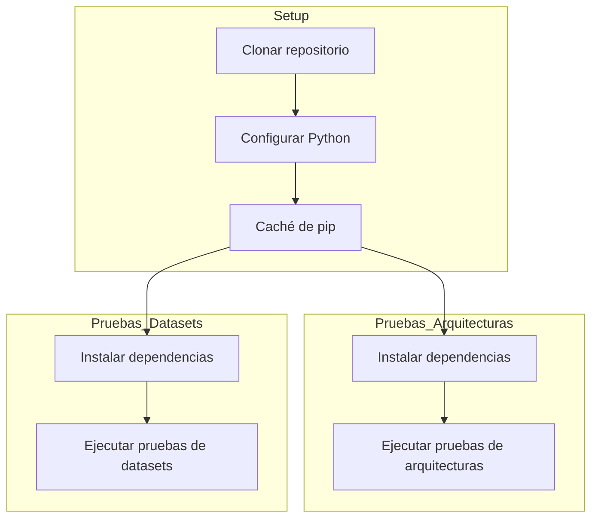
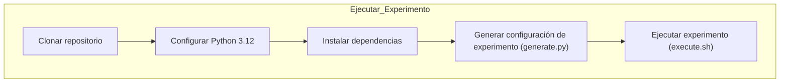

# Descripción General del Flujo de Trabajo de CI y Experimentos

Este documento describe los dos flujos de trabajo de GitHub Actions utilizados en este proyecto:

## ✅ 1. Ejecutar Pruebas – Integración Continua (CI)

Este flujo de trabajo garantiza la calidad y corrección del código al ejecutar pruebas sobre componentes arquitectónicos y módulos relacionados con conjuntos de datos. Se ejecuta automáticamente en:
- Push a las ramas main o develop
- Cualquier pull request

### 🧪 Flujo de trabajo

El flujo de trabajo consta de tres tareas (jobs):
- Configuración (Setup)
Prepara el entorno mediante:
  - Clonación del repositorio
  - Configuración de Python
  - Caché de dependencias de pip

- Pruebas de Arquitecturas
  - Instala dependencias
  - Ejecuta pruebas en tests/architectures/

- Pruebas de Conjuntos de Datos
  - Instala dependencias
  - Ejecuta pruebas en tests/datasets/

### ⚙️ Diagrama del Flujo de Trabajo de CI

## 🚀 2. Ejecutar Flujo de Trabajo de Experimentos

Este flujo de trabajo se ejecuta automáticamente con cada push a main. Está diseñado para automatizar el proceso de configuración y ejecución de experimentos.

### ⚙️ Diagrama del Flujo de Trabajo de CI

