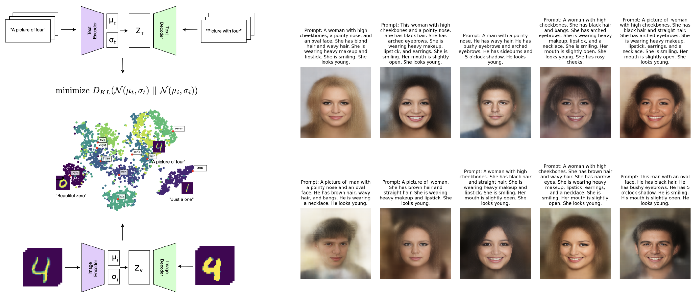
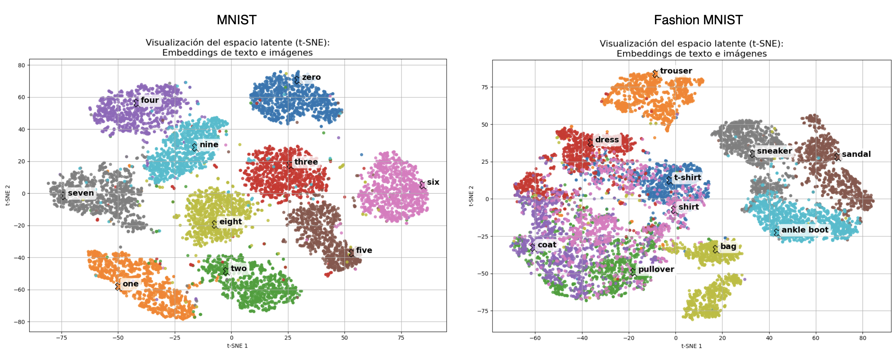
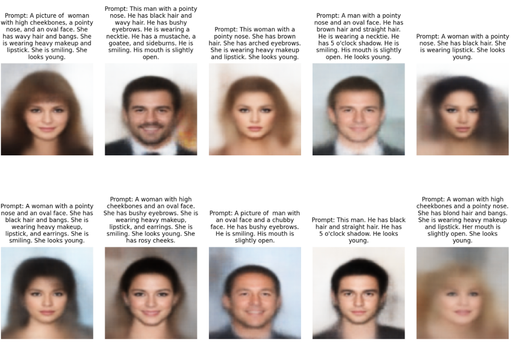

<h1 align="center">Re-MVAE:<br>Recurrent Multimodal VAE</h1>

<br>
<br>

<p align="center"></p>

<br>

<div align="justify">

Este repositorio forma parte del Trabajo de Fin de Grado titulado: **Estudio acerca del entrenamiento con alineamiento de representaciones multimodales en el espacio latente**. El objetivo principal es lograr un alineamiento multimodal efectivo basado en Variational Autoencoders (VAE), con el fin de construir espacios latentes estructurados y manejables que permitan la generación cruzada entre modalidades (por ejemplo, generar texto a partir de imágenes y viceversa).

Este trabajo extiende la idea tradicional de los MVAE (Multimodal VAE) incorporando modelos recurrentes para la modalidad de texto, utilizando RNNs (LSTM, GRU, XLSTM), con el propósito de capturar la secuencialidad inherente a la información textual, mejorando así la calidad y coherencia de las representaciones latentes.

## 1. Objetivo principal

Podríamos decir que este trabajo se propone con la idea de abarcar los siguientes objetivos principales:

- Construir espacios latentes compartidos entre diferentes modalidades que estén alineados, de modo que representaciones de la misma información, pero en diferentes formatos (imagen, texto), sean cercanas en el espacio latente.
- Utilizar esta estructura latente para generación cruzada:
    - Reconstrucción multimodal
    - Traducción de modalidades (ej. imagen → texto)
    - Transferencia de estilos o contenido entre modalidades
- Explorar arquitecturas recurrentes para la parte textual, aprovechando la capacidad de las RNN para modelar dependencias temporales.

## 2. Estructura general del proyecto y módulos principales

El proyecto está diseñado con una arquitectura modular, flexible y escalable. A continuación se describen los módulos principales del framework:

- **core/**
Contiene las interfaces y componentes fundamentales del framework. Su propósito es establecer una base común y coherente que asegure la compatibilidad e integración armoniosa entre los distintos módulos:

  - vae.py: Define la interfaz del modelo Variational Autoencoder, incluyendo los métodos de codificación y decodificación.
  - wrapper.py: Proporciona una clase base que permite extender y personalizar el comportamiento del modelo.
  - trainer.py: Implementa la lógica de entrenamiento del modelo, incluyendo el ciclo de entrenamiento, cálculo de pérdidas y optimización.
  - evaluator.py: Define los componentes encargados de evaluar los modelos una vez han sido entrenados, incluyendo métricas y criterios de validación.
    
- **playground/**
Siguiendo las interfaces definidas en `core/`, un usuario/investigador puede definir sus propias arquitecturas, datasets y trainers, para poder experimentar con esta aproximación, asegurando la integración de los nuevos componentes con los ya existentes y testeados. Para ello, este módulo está dividido, a su vez, en los siguientes:

	- **architectures/**
Implementa las arquitecturas específicas para cada modalidad y variantes del modelo:
  		- Encoders y decoders para imágenes (CNNs, autoencoders convolucionales).
  		- Modelos recurrentes para texto (LSTM, GRU, XLSTM).
  		- Wrappers y builders para combinar los módulos en modelos completos.

	- **trainers/**
Implementa diferentes estrategias y variantes de entrenamiento, incluyendo técnicas avanzadas como annealing o entrenamiento adaptativo para mejorar la convergencia y el alineamiento de representaciones.

	- **evaluators/**
Provee métricas y herramientas para evaluar modelos: calidad de reconstrucción, métricas específicas para imágenes (FID), métricas para texto (perplejidad), y evaluadores combinados para espacios multimodales.

	- **readers/**
Módulos dedicados a cargar y preprocesar datasets multimodales, permitiendo su integración en el pipeline de entrenamiento.
Cada dataset está encapsulado en su propio lector, lo que facilita añadir nuevos conjuntos de datos.

- **generator/**
Implementa la lógica necesaria para poder crear experimentos a partir de una notación estructurada en formato json. Para eso, usa plantillas de python que son renderizadas según los argumentos de entrada. Los experimentos son creados con los componentes creados en `playground/`.

- **experiments/**
Contiene directorios con scripts que permiten la ejecucion de distintos experimentos, creados automáticamente por `generator/` a partir de los ficheros de definición de experimentos `args.json`. Los scripts que componen cada experimento son:

	- **train.py**: Define y entrena un modelo dadas una configuración, un dataset y un trainer.
 	- **visualize.py**: Mediante generación cruzada, permite evaluar los modelos de una forma visual, generando imágenes que permitan corroborar el correcto entrenamiento de los modelos.
  	- **eval.py**: Utiliza los evaluadores definidos en `args.json` para generar métricas que permitan comparar los modelos entre sí, además de evaluar numéricamente su rendimiento.
  	- **report.py**: Genera un informe pdf con los resultados obtenidos por `visualize.py` y `report.py`.
 
	Se pueden añadir nuevos experimentos simplemente creando un nuevo directorio y definiendo en él el experimento mediante un fichero `args.json`.

- **tests/**
Adicionalmente, se añade un módulo de pruebas unitarias que permiten verificar la correcta funcionalidad de los componentes ya implementados en `playground/`, garantizando robustez y facilidad para futuras modificaciones.

## 3. Resultados

Para este trabajo, se han realizado experimentos basados en los datasets MNIST, FashionMNIST y CelebA, todos ellos extendidos en `reader/` para devolver pares de texto e imagen sobre los que poder buscar un alineamiento. En cuanto a las arquitecturas recurrentes, se han implementado en este trabajo LSTM, GRU y xLSTM, permitiendo modelar la información textual de una forma más natural que aproximaciones previas. La siguientes tablas muestran, para los datasets MNIST y FashionMNIST, las métricas de precisión obtenidas. Estás métricas se han obtenido de la siguiente forma:

- **Text-to-image accuracy**: Utilizando un modelo de clasificacion de imágenes, se calculó el porcentaje de ocasiónes que la imagen generada según una etiqueta era clasificada con esa etiqueta justamente. Mide, por tanto, como de fiel es la generacion de imágenes a partir de texto.
- **Image-to-text accuracy**: Utilizando un modelo de clasificacion de imágenes, se calculó el porcentaje de ocasiónes que el texto generado a partir de una imagen contenía la etiqueta correcta de la imagen. Así, esta métrica mide como de buena es la generación de texto es a partir de imágenes, indicando un mejor accuracy mejores descripciones.
- **Text reconstruction perplexity**: Determina la calidad de las reconstrucciones de las descripciones textuales para el VAE de texto. Permite comprobar que el modelo de lenguaje es capaz de generar muestras con sentido a partir de representaciones latentes. Aunque es similar al MSE en este caso, es especialmente útil para compararla con **Image-to-text perplexity**.
- **Image-to-text perplexity**: Determina la calidad de las descripciones generadas a partir de imágenes, independientemente de las etiquetas de las mismas. Mide la cohesión de los textos generados, y permite comparar modelos en cuando a generación realista de los textos.
- **Original text perplexity**: Mide la perplejidad del texto original del dataset, sirviendo como referencia para comparar la calidad de los textos generados.

<div align="center">
  <table border="1" style="border-collapse: collapse; width: 80%;">
    <caption style="font-weight: bold; font-size: 1.2em; margin-bottom: 15px; caption-side: top;">
      <b>Tabla 1</b>: Comparación de modelos entrenados con MNIST y Fashion MNIST
    </caption>
    <thead>
      <tr>
        <th style="padding: 10px; text-align: left; background-color: #f2f2f2;">Evaluador</th>
        <th style="padding: 10px; text-align: center; background-color: #f2f2f2;">MNIST</th>
        <th style="padding: 10px; text-align: center; background-color: #f2f2f2;">Fashion MNIST</th>
      </tr>
    </thead>
    <tbody>
      <tr>
        <td style="padding: 10px; border-bottom: 1px solid #ddd;">Text-to-image accuracy</td>
        <td style="padding: 10px; text-align: center; border-bottom: 1px solid #ddd;">76.18%</td>
        <td style="padding: 10px; text-align: center; border-bottom: 1px solid #ddd;">64.06%</td>
      </tr>
      <tr>
        <td style="padding: 10px; border-bottom: 1px solid #ddd;">Image-to-text accuracy</td>
        <td style="padding: 10px; text-align: center; border-bottom: 1px solid #ddd;">82.13%</td>
        <td style="padding: 10px; text-align: center; border-bottom: 1px solid #ddd;">70.25%</td>
      </tr>
      <tr>
        <td style="padding: 10px; border-bottom: 1px solid #ddd;">Text reconstruction PPL</td>
        <td style="padding: 10px; text-align: center; border-bottom: 1px solid #ddd;">239.65</td>
        <td style="padding: 10px; text-align: center; border-bottom: 1px solid #ddd;">485.07</td>
      </tr>
      <tr>
        <td style="padding: 10px; border-bottom: 1px solid #ddd;">Image-to-text PPL</td>
        <td style="padding: 10px; text-align: center; border-bottom: 1px solid #ddd;">272.98</td>
        <td style="padding: 10px; text-align: center; border-bottom: 1px solid #ddd;">498.02</td>
      </tr>
      <tr>
        <td style="padding: 10px;">Original text PPL</td>
        <td style="padding: 10px; text-align: center;">272.18</td>
        <td style="padding: 10px; text-align: center;">492.34</td>
      </tr>
    </tbody>
  </table>
</div>

Podemos ver cómo, para ambos dataset, los resultados obtenidos son bastante buenos. En cuanto a la diferencia de accuracy, esto se debe a dos factores:

1. **Accuracy de los modelos de clasificación**: Para el dataset MNIST, se utilizón como clasificador el modelo `farleyknight/mnist-digit-classification-2022-09-04`, basado en ViT, que posee más de un **99%** de accuracy. Por otro lado, para el dataset FashionMNIST se utilizó un modelo que fue entrenado por nosotros mismos, que llegó al **91%** aproximadamente.

2. **Complejidad del dataset**: El dataset FashionMNIST posee clases que son visualmente más similares entre sí que MNIST. Por ejemplo, las clases `coat` y `pullover` poseen muestras que son a simplemente muy parecidas. Esto da lugar a que las representaciones latentes asociadas a muestras de estas clases estén más próximas en el espacio latente, lo que a veces dará lugar a confusión en la generación cruzada. Esto puede comprobarse fácilmente en la siguiente Figura, que muestras los espacios latentes generados para cada dataset.

<p align="center"></p>

En cuanto a los experimentos realizados para CelebA, las tres arquitecturas LSTM, GRU y xLSTM han demostrado adaptarse con éxito al marco variacional para construir espacios latentes semánticos y alineados. No obstante, xLSTM ha mostrado una mejor adaptación, tal y como se puede comprobar en la Tabla 2. Las métricas mostradas en esta tabla son:

- **Reconstruction FID**: Mide la distancia entre las imágenes reales y sus reconstrucciones a partir del espacio latente. Evalúa cuán fielmente el modelo es capaz de reconstruir imágenes originales tras codificarlas y decodificarlas.
- **Generation FID**: Calcula la distancia entre imágenes reales y otras generadas directamente desde muestras aleatorias del espacio latente. Permite valorar la calidad y realismo de las imágenes generadas sin referencia directa a imágenes originales.
- **Difference FID**: Es la diferencia entre el Reconstruction FID y el Generation FID para una misma arquitectura y resolución. Indica cuánto pierde el modelo al pasar de reconstruir imágenes conocidas a generar imágenes nuevas desde ruido, siendo valores bajos indicativos de un espacio latente bien estructurado.

<div align="center">
  <table border="1" style="border-collapse: collapse; width: 90%; font-family: Arial, sans-serif;">
     <caption style="font-weight: bold; font-size: 1.2em; margin-bottom: 15px; caption-side: top;">
      <b>Tabla 2</b>: Comparación de arquitecturas 
    </caption>
    <thead>
      <tr style="background-color: #f2f2f2;">
        <th style="padding: 10px; text-align: left;">Architecture</th>
        <th style="padding: 10px; text-align: center;">Resolution</th>
        <th style="padding: 10px; text-align: center;">Reconstruction FID</th>
        <th style="padding: 10px; text-align: center;">Generation FID</th>
        <th style="padding: 10px; text-align: center;">Difference FID</th>
      </tr>
    </thead>
    <tbody>
      <tr>
        <td style="padding: 10px; border-bottom: 1px solid #ddd;">GRU</td>
        <td style="padding: 10px; text-align: center; border-bottom: 1px solid #ddd;">56x56</td>
        <td style="padding: 10px; text-align: center; border-bottom: 1px solid #ddd;">102.02</td>
        <td style="padding: 10px; text-align: center; border-bottom: 1px solid #ddd;">111.31</td>
        <td style="padding: 10px; text-align: center; border-bottom: 1px solid #ddd;">9.29</td>
      </tr>
      <tr>
        <td style="padding: 10px; border-bottom: 1px solid #ddd;">GRU</td>
        <td style="padding: 10px; text-align: center; border-bottom: 1px solid #ddd;">32x32</td>
        <td style="padding: 10px; text-align: center; border-bottom: 1px solid #ddd;">107.07</td>
        <td style="padding: 10px; text-align: center; border-bottom: 1px solid #ddd;">111.04</td>
        <td style="padding: 10px; text-align: center; border-bottom: 1px solid #ddd;">3.97</td>
      </tr>
      <tr>
        <td style="padding: 10px; border-bottom: 1px solid #ddd;">GRU</td>
        <td style="padding: 10px; text-align: center; border-bottom: 1px solid #ddd;">128x128</td>
        <td style="padding: 10px; text-align: center; border-bottom: 1px solid #ddd;">128.83</td>
        <td style="padding: 10px; text-align: center; border-bottom: 1px solid #ddd;">138.64</td>
        <td style="padding: 10px; text-align: center; border-bottom: 1px solid #ddd;">9.81</td>
      </tr>
      <tr>
        <td style="padding: 10px; border-bottom: 1px solid #ddd;">LSTM</td>
        <td style="padding: 10px; text-align: center; border-bottom: 1px solid #ddd;">32x32</td>
        <td style="padding: 10px; text-align: center; border-bottom: 1px solid #ddd;">101.57</td>
        <td style="padding: 10px; text-align: center; border-bottom: 1px solid #ddd;">113.53</td>
        <td style="padding: 10px; text-align: center; border-bottom: 1px solid #ddd;">11.96</td>
      </tr>
      <tr>
        <td style="padding: 10px; border-bottom: 1px solid #ddd;">LSTM</td>
        <td style="padding: 10px; text-align: center; border-bottom: 1px solid #ddd;">56x56</td>
        <td style="padding: 10px; text-align: center; border-bottom: 1px solid #ddd;">100.24</td>
        <td style="padding: 10px; text-align: center; border-bottom: 1px solid #ddd;">110.76</td>
        <td style="padding: 10px; text-align: center; border-bottom: 1px solid #ddd;">10.52</td>
      </tr>
      <tr>
        <td style="padding: 10px; border-bottom: 1px solid #ddd;">LSTM</td>
        <td style="padding: 10px; text-align: center; border-bottom: 1px solid #ddd;">128x128</td>
        <td style="padding: 10px; text-align: center; border-bottom: 1px solid #ddd;">124.78</td>
        <td style="padding: 10px; text-align: center; border-bottom: 1px solid #ddd;">136.92</td>
        <td style="padding: 10px; text-align: center; border-bottom: 1px solid #ddd;">12.14</td>
      </tr>
      <tr>
        <td style="padding: 10px; border-bottom: 1px solid #ddd;">xLSTM</td>
        <td style="padding: 10px; text-align: center; border-bottom: 1px solid #ddd;">32x32</td>
        <td style="padding: 10px; text-align: center; border-bottom: 1px solid #ddd;">102.71</td>
        <td style="padding: 10px; text-align: center; border-bottom: 1px solid #ddd;">106.82</td>
        <td style="padding: 10px; text-align: center; border-bottom: 1px solid #ddd;">4.11</td>
      </tr>
      <tr>
        <td style="padding: 10px; border-bottom: 1px solid #ddd;">xLSTM</td>
        <td style="padding: 10px; text-align: center; border-bottom: 1px solid #ddd;">56x56</td>
        <td style="padding: 10px; text-align: center; border-bottom: 1px solid #ddd;">100.38</td>
        <td style="padding: 10px; text-align: center; border-bottom: 1px solid #ddd;">107.92</td>
        <td style="padding: 10px; text-align: center; border-bottom: 1px solid #ddd;">7.54</td>
      </tr>
      <tr>
        <td style="padding: 10px;">xLSTM</td>
        <td style="padding: 10px; text-align: center;">128x128</td>
        <td style="padding: 10px; text-align: center;">130.70</td>
        <td style="padding: 10px; text-align: center;">136.55</td>
        <td style="padding: 10px; text-align: center;">5.85</td>
      </tr>
    </tbody>
  </table>
</div>

En la portada de esta presentación se puede apreciar la calidad de las imágenes una vez procesadas con CodeFormer. Sin embargo, teniendo en cuenta las limitaciones de los VAE, además de las bajas resoluciones que pudieron probarse para este experimento, la calidad de las imágenes generadas es bastante buena. Esto es algo que puede apreciarse en la siguiente Figura.

<p align="center"></p>

</div>

<br>
<h1 align="center">Extensión del framework:<br>explorando nuevas configuraciones</h1>

<br>
<br>

<div align="justify">

A continuación, se describen los pasos necesarios para extender el framework Re-MVAE, permitiendo la incorporación de nuevas arquitecturas, conjuntos de datos, evaluadores y experimentos. Esta guía proporciona las convenciones de estructura, nomenclatura y diseño que deben seguirse para garantizar una integración coherente y funcional dentro del sistema. El objetivo es ofrecer un marco flexible que facilite la experimentación y el desarrollo de nuevas variantes del modelo.

## 1. Crear una arquitectura

Para definir una nueva arquitectura variacional, se debe crear un nuevo directorio dentro del módulo `playground/architectures/`. La convención de nombres utilizada es `CamelCase`, ya que facilita su integración con el módulo `generator/`.

Una vez creado el directorio, hay que implementar la arquitectura para que pueda ser utilizada en los experimentos. Para ello, es fundamental definir una clase llamada `Builder`, la cual debe devolver un objeto que herede de la interfaz `TextVAE` o `ImageVAE` y que implemente la lógica específica de la arquitectura. Por convención, esta clase debe estar en un archivo llamado `builder.py`.

Además, para que el sistema pueda importar correctamente la clase, se debe añadir un archivo `__init__.py` dentro del directorio, con el siguiente contenido:

```python
from .builder import Builder
```

### Plantilla de instanciación (build.template)

Para permitir que el módulo generator/ sepa cómo instanciar la arquitectura, es necesario crear un archivo build.template en el mismo directorio. Este archivo contiene una plantilla de código que especifica cómo debe construirse la arquitectura utilizando la clase `Builder`. Por ejemplo:

```python
image_model = ImageBuilder().build(
    args["image_size"], args["input_channels"], args["latent_dim"], args["conv_dims"]
)
```

La plantilla asume que existen ciertos argumentos en el diccionario `args`, tales como `image_size`, `input_channels`, etc. Estos parámetros deben estar definidos en el archivo `args.json`, descrito en la sección 3. Crear un experimento, y pueden modificarse para incluir nuevos argumentos según se requiera.

### Importación de librerías externas (libs.template)

Si la arquitectura necesita librerías adicionales que no forman parte del ecosistema PyTorch, se deben importar explícitamente mediante el archivo `libs.template`. Este archivo contiene las instrucciones necesarias para realizar dichas importaciones en el contexto del experimento.

Por ejemplo, en la arquitectura `xLSTMSeq2seqBidirectionalAutoregressive`, el contenido de libs.template puede ser:

```python
from omegaconf import OmegaConf
from dacite import from_dict, Config as DaciteConfig
from xlstm import xLSTMBlockStackConfig
```

## 2. Importar un dataset

Para importar un conjunto de datos, simplemente se debe definir una clase encargada de leer y adaptar dichos datos a un formato interpretable por los modelos. Estas clases se denominan readers.

Para crear un nuevo Reader, es necesario generar un subdirectorio en el módulo `playground/readers/`, nombrado también en `CamelCase`. Dentro de este subdirectorio, los datos deben almacenarse en una carpeta `data/`, y la clase Reader debe implementarse en un archivo llamado `reader.py`. Esta clase será la responsable de cargar y transformar los datos, y el constructor SIEMPRE recibirá los mismos parámetros: `train`: boolean, `transform`: Callable y `len`: int.

La clase `Reader` debe extender la clase Dataset de PyTorch. Esto permite integrarla fácilmente con los DataLoader, lo que facilita el manejo eficiente de lotes durante el entrenamiento y garantiza una compatibilidad directa con el pipeline de entrenamiento del modelo.

A continuación, se muestra como ejemplo el Reader correspondiente al clásico dataset MNIST:

```python
class Reader(Dataset):
    def __init__(self, 
                train: Optional[bool] = True, 
                transform: Optional[Callable] = None, 
                len: Optional[int] = 2000
            ):

        self.dataset = datasets.MNIST(
            root='readers/MNISTImageDataset/data',
            train=train,
            download=True,
            transform=transform
        )

    def __len__(self) -> int:
        return len(self.dataset)

    def __getitem__(self, idx: int) -> Tensor:
        image, _ = self.dataset[idx]
        return image
```

## 3. Crear un evaluador

Para definir un nuevo evaluador, es necesario crear un subdirectorio dentro del módulo `playground/evaluators/`, utilizando la convención de nombres `CamelCase`, al igual que en el caso de las arquitecturas y los readers. Dentro de este subdirectorio se implementará la clase del evaluador, la cual debe ajustarse a la interfaz `Evaluator`, definida en el módulo `core/`. Esto garantiza una integración uniforme con el sistema de ejecución de experimentos y permite su uso dentro del entorno de evaluación.

La clase del evaluador debe implementar todos los métodos definidos en la interfaz `Evaluator`, incluyendo la lógica específica de evaluación, el manejo de resultados y cualquier métrica que se desee calcular. Esta estructura asegura que cualquier evaluador, independientemente del tipo de datos o del modelo utilizado, sea compatible con el resto del framework.

Además del código fuente del evaluador, se deben definir dos archivos de plantilla: <nombre del evaluador>.template y <nombre del evaluador>.call.template. El primero describe cómo se instancia el evaluador dentro del flujo de un experimento, y el segundo especifica cómo debe llamarse o ejecutarse durante la evaluación. Estas plantillas permiten al sistema generar dinámicamente el código necesario para incorporar el evaluador, manteniendo la flexibilidad y automatización del pipeline experimental.

Por ejemplo, en el caso de una evaluación basada en FID para imágenes, el archivo `ImageFIDEvaluator.template` podría contener:

```python
def evaluate_image_fid(image_model, loader, device, results_dir):
    print("\nEvaluating Image FID...")
    evaluator = ImageFIDEvaluator(
        model=image_model,
        dataset=loader,
        device=device,
        image_size=(56, 56)
    )
    fid_rec, fid_gen = evaluator.evaluate()
    print(f"FID Score for Reconstructed Images (Image Reconstruction): {fid_rec:.2f}")
    print(f"FID Score for Generated Images (Image Reconstruction): {fid_gen:.2f}")
    save_metrics({
        "FID_reconstructed": fid_rec,
        "FID_generated": fid_gen
    }, results_dir, "eval_image_fid.json")
```


Mientras que el archivo `ImageFIDEvaluator.call.template` incluiría simplemente la llamada correspondiente:

```python
evaluate_image_fid(image_model, loader, device, args["results_dir"])
```

Estas plantillas deben colocarse en el mismo subdirectorio del evaluador, y sus nombres deben coincidir con el identificador del evaluador, para que puedan ser referenciadas correctamente desde la configuración del experimento.

## 4. Crear un experimento

Para crear un experimento, será necesario crear un directorio dentro de `experiments/` que contendrá el código fuente del experimento. Supongamos, por ejemplo, que queremos crear un experimento llamado `example`.

```bash
mkdir experiments/example
```

Hecho esto, habrá que definir el experimento, creando para ello un fichero `args.json` en su directorio principal.

```bash
touch experiments/example/args.json
```

Dicho fichero contendrá un objeto JSON el cual contenga todos los argumentos necesarios para la creación de sus scripts y ejecución de los mismos. En la implementación base, los posibles argumentos son los siguientes:

```json
{
    "name": "[str: NOMBRE DEL DIRECTORIO DEL EXPERIMENTO (experiments/NOMBRE)]",
    "reader": "[str: NOMBRE DATASET (ver readers/)]",
    "text_architecture": "[str: NOMBRE DE LA ARQUITECTURA PARA TEXTO]",
    "image_architecture": "[str: NOMBRE DE LA ARQUITECTURA PARA IMAGEN]",
    "tokenizer_path": "[str: RUTA DONDE GUARDAR EL TOKENIZADOR DEL DATASET]",
    "dataset_length": "[int: NÚMERO DE MUESTRAS QUE QUEREMOS EN EL DATASET]",
    "image_size": "[int: RESOLUCIÓN DE LA IMAGE, ej. (128)x128]",
    "latent_dim": "[int: DIMENSIÓN DEL ESPACIO LATENTE]",
    "conv_dims": "[list[int,]: DIMENSIONES DE LA ARQUITECTURA DE IMAGEN, SI ES CONVOLUCIONAL]",
    "dims": "[list[int,]: DIMENSIONES DE LA ARQUITECTURA DE IMAGEN, SI ES LINEAL]",
    "embedding_dim": "[int: TAMAÑO DE EMBEDDINGS RNN]",
    "hidden_dim": "[int: TAMAÑO DEL ESTADO OCULTO RNN]",
    "context_length": "[int: TAMAÑO DE VENTANA DE CONTEXTO RNN]",
    "batch_size": "[int: TAMAÑO DEL BATCH]",
    "epochs": "[int: NÚMERO DE ÉPOCAS DE ENTRENAMIENTO]",
    "trainer": "[str: NOMBRE DEL TRAINER]",
    "training_method": "[int: TIPO DE ANNEALING A APLICAR]",
    "weights": "[dict(str, int): PESOS DE ENTRENAMIENTO]",
    "teacher_forcing_ratio": "[float: PROCENTAJE DE APLICACIÓN DE TEACHER FORCING]",
    "k": "[int: PESO ASOCIADO AL ANNEALING]",
    "x0": "[int: PESO ASOCIADO AL ANNEALING]",
    "results_dir": "[str: RUTA DE RESULTADOS]",
    "checkpoint_dir": "[str: RUTA DE CHECKPOINTS]",
    "checkpoint_steps": "[int: INTERVALO DE CHECKPOINTS]",
    "evaluators": "[list(str): EVALUADORES]"
}
```

Los parámetros `reader`, `text_architecture` e `image_architecture` deben coincidir con el módulo donde se encuentran definidas estas arquitecturas.

Para crear el experimento a partir del fichero `args.json`, se ha de usar el módulo `generator/`, según el siguiente comando:

```bash
python generator/generate.py experiments/example/args.json
```

Con esto, el experimento estará creado.

## 5. Ejecutar un experimento

Una vez creado el experimento, se puede acceder al directorio del mismo y ejecutarlo:

```bash
cd experiments/example
chmod +x execute.sh && execute.sh
```

