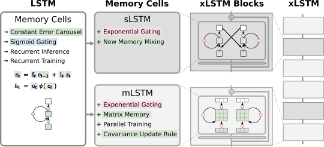

# xLSTM: Extended Long Short-Term Memory

This repo contains the source code of the architecture xLSTM, proposed in the original [repo](https://github.com/NX-AI/xlstm). However, some key modifications have been made in order to apply the architecture into a Seq2seq structure, allowing to define autoregressive decoders.